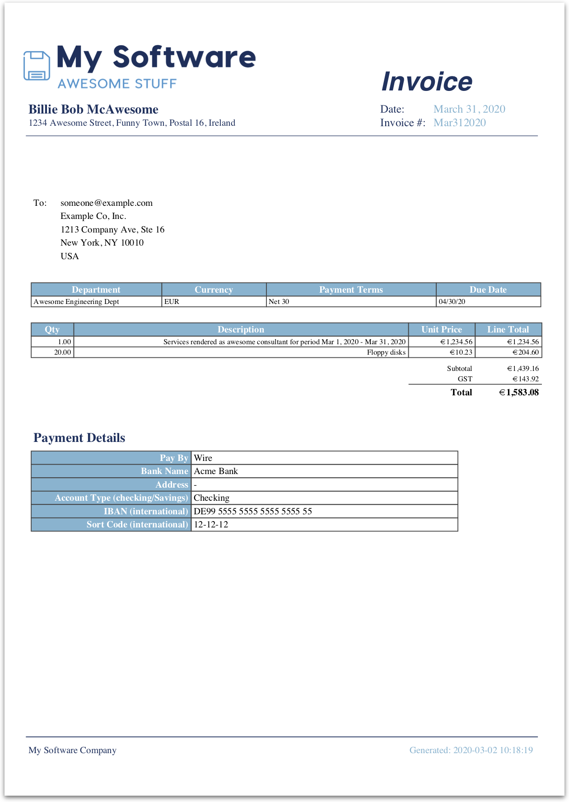

Billmonger
==========

Billmonger is a dead simple PDF one-page invoice generator written in Go. The
intention is to make the generated invoices look professional and have them be
repeatable. You can use your own company logo and two company colors as part of
the invoice, and each invoice is configurable with a single YAML file.

Billmonger makes many assumptions to keep things simple. Some of them
are:

 * You will have two company colors or use two generic colors
 * You will not invoice for more than about a dozen items
 * The billing period is a month (semi-configurable)
 * The bill due date is a month boundary
 * Everything on the bill is the same currency
 * Filenames will be output in a standard way

Current limitations:
 * It almost has support for tax calculation but it's not there yet

The Problem This Solves
------------------------

You have a small business and need to regularly generate bills, perhaps as a
contractor. Your bills are fairly similar but may have different line items.
This will generate a nice A4 PDF that looks professional and is easily
customizable to your business.

What It Looks Like
------------------

The sample `billing.example.yaml` file [provided](billing.example.yaml) will
generate a [PDF file](assets/example.pdf) that looks like this:



Configuration
-------------

Configuration is done in the YAML file (`billing.yaml` by default). This
describes the bill and the billables to be reported. It supports a couple of
templating features that make reporting items easier. These are Go template
functions and are to be put inside double curly braces anywhere in the YAML
file. Interpretation of the template happens _before_ YAML processing.
Examples:

 * `{{ endOfNextMonth }}`: This will be substituted with the end day of the
   month following the current month.
 * `{{ endOfThisMonth }}`: This will be substituted with the end day of the
   current month.
 * `{{ billingPeriod }}`: This will be substituted with the current month's
   beginning and end dates.

CLI Flags
---------

`billmonger` currently takes a single CLI flag, to tell it which config file
to use to run the bill. The default is `billing.yaml`, but you may specify
otherwise like so:

```bash
$ ./billmonger -c my-other-config.yaml
```

You may ask for help on the command line in the semi-standard way:

```bash
$ ./billmonger --help
usage: billmonger [<flags>]

Flags:
      --help            Show context-sensitive help (also try --help-long and
                        --help-man).
  -c, --config-file="billing.yaml"
                        The YAML config file to use
  -b, --billing-date="2019-12-29"
                        The date to assume the bill is written on
  -o, --output-dir="."  The output directory to use. Overriden by config file.
```

Using Docker
------------

You can run Billmonger from the command line. But some folks have found that
it's useful to run it from a Docker container directly.  This is also
supported! Here are the steps in order to do that.  To build it and run it
directly from a Docker container you need to:

The following assumes that you have a directory in your current path called
`./billmonger/invoices` where you would like to output PDF files from
Billmonger. You can substitute this for any other local path that is
convenient.

We will also need to be able to mount the config file from our local filesystem
into the Docker container. In the example below this file also lives in
`./billmonger/invoices`

Similarly, we may want to mount assents like the logo files from a different
local directory. This is assumed to be `./billmonger/assets` in  this example.
In order to use assets from this path, you need to include `assets/` in the
image filename in your config file.

1. Run `docker build . --tag billmonger` and then ...
2. Run ```
   docker run \
     --volume ${PWD}/billmonger/invoices:/invoices \
     --volume ${PWD}/billmonger/assets:/assets \
	 billmonger \
	   --output-dir /invoices \
	   --config-file /invoices/billing.example.yaml
   ```

In order to make this all easier to run, you may want to alias the docker run
command something like this: 
```
alias='docker run --volume ${PWD}/billmonger/invoices:/invoices --volume ${PWD}/billmonger/assets:/assets billmonger --output-dir /invoices'
```

Saving that in your `.profile` will make it permanently available.  Having done
that, you can then run the following at any time:
```
billmonger --config-file /invoices/billing.example.yaml
``` 

Be sure to run it from the local path where you mounted the config file.
